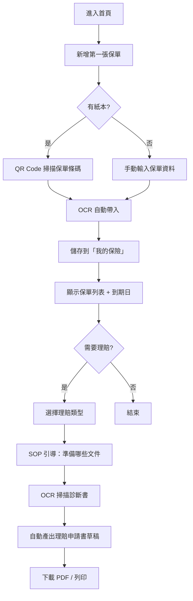
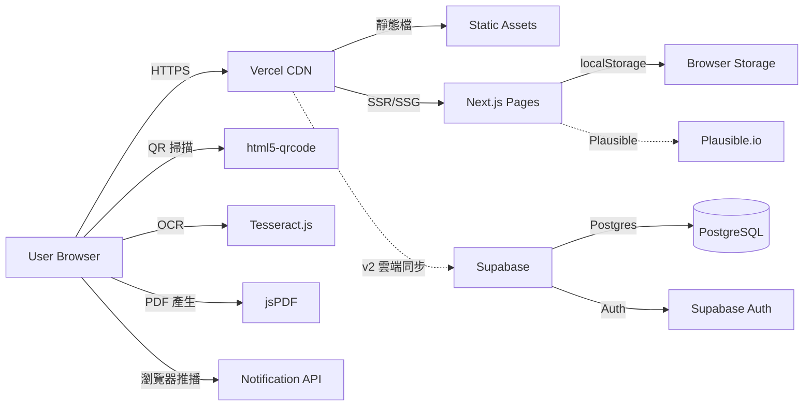

# 保險資料對比 + 理賠流程 — 規格計劃書 v2.2.1

> 版本：v2.2.1｜更新日期：2026-07-19｜維護者：Sophia (CPO) / 對接技術：Alan (CTO)
> 主題：**保險單 QR 碼掃描 + 個人保險資料夾**（不做銷售導購）
> Sweet Spot 定位：**「我的保險」個人資料夾 + 理賠流程 SOP**
> 文件版本：v2.2.1（2026-07-19 sweet-spot-driven rewrite）

---

## §0 文件資訊

| 欄位 | 值 |
|---|---|
| 專案代號 | insurance-hub |
| GitHub | https://github.com/openclawsean024-create/insurance-hub |
| 開發模式 | 純前端 SPA + localStorage（v2 加雲端同步） |
| 目標市場 | 繁體中文使用者（台灣，25-50 歲已購保族群） |
| 變現模式 | 免費 + 廣告 + Premium NT$99/月（無限保單 + 家人都保險資料夾） |
| 文件版本 | v2.2.1（2026-07-19 sweet-spot-driven rewrite） |
| Sweet Spot 分數 | **5 / 7**（甜蜜點存在，但金管會監管 + 付費弱） |
| 行動建議 | **investigate**（§11 驗證後啟動開發） |

---

## §1 產品概述

### §1.1 問題陳述

**市場現況（Sweet Spot 體檢結果）**：
- **Finfo / MY83 已佔保險比較市場**：Finfo 月活躍 80 萬、MY83 月活躍 50 萬，皆主打保險比較 + 內容
- **金管會監管嚴格**：保險業務員需有「業務員證」、招攬行為需合規；個人開發者無法做銷售導購
- **B2C 月訂閱付費意願弱**：保險是「低頻決策」，使用者願意花 NT$1,000+ 買保險，但不願付 NT$99/月 訂閱工具
- **保險業務員有「單一視窗」需求**：業務員需管理 100+ 客戶保單，目前用 Excel

**剩下的甜蜜縫隙（Sean 一人公司可切入的）**：
1. **「我的保險」個人資料夾**：用 QR Code 掃描保單 + OCR 自動建檔（不賣保險）
2. **理賠流程 SOP**：用 OCR 掃描診斷書 + 自動產出理賠申請書草稿
3. **保險到期提醒**：儲存保單後，主動提醒續保/到期
4. **家庭保險資料夾**：管理 5-10 個家人的保單（v2 Premium 變現場景）

**本 PRD 的問題假設**：
> 「已購保險的消費者想要的是『隨時能找到我的保單、知道怎麼理賠』，不是『比較新保險』。」

驗證方式見 §11。

### §1.2 目標使用者 (User Personas)

| Persona | 規模 (台灣估) | 痛點 | 對應功能 |
|---|---|---|---|
| **P1：30-50 已購保者**（最大宗） | ~600 萬 | 手上有 3-10 張保單，紙本散落，需要找時找不到 | 「我的保險」資料夾 |
| **P2：保險業務員**（小但黏） | ~30,000 人 | 需管理 100+ 客戶保單，目前用 Excel | 客戶保險資料夾（B2B） |
| **P3：新手爸媽**（次大宗） | ~50 萬/年 | 需幫新生兒規劃保險，但 Finfo/MY83 比較文看不懂 | 簡單保險類型教學 + 個人資料夾 |
| **P4：理賠需求者**（跨族） | ~200 萬/年 | 出險時不知道怎麼申請理賠，常錯過資料準備 | 理賠流程 SOP |

> 本 MVP **只服務 P1 + P4**，P2 業務員版留到 v2 驗證後再加，P3 新手爸媽留到 v3。

### §1.3 核心價值主張

> **「QR 掃一下，所有保單都在手機 — 不賣保險、不比較保險，只幫你管好你的保單。」**

**相對 Top 3 競爭者的差異化**：

| 競爭者 | 他們做什麼 | 我們不做 | 我們做（甜蜜點） |
|---|---|---|---|
| **Finfo / MY83** | 保險比較 + 內容 + 業務員媒合 | 比較新保險、銷售導購 | 已購保單管理 + 理賠 SOP |
| **保險公司 App** | 各家自己的保單查詢 | 跨公司整合、跨平台 | 跨公司 + 跨家人 |
| **保險業務員 Excel** | 業務員管理客戶保單 | 個人保險資料夾 | 純消費者工具 |
| **健保快易通 App** | 健保資料查詢 | 健保（非商業保險） | 商業保險 |

### §1.4 商業目標 (KPIs / OKRs)

**3 個月 MVP 驗證目標**：
- **O1**：驗證「個人保險資料夾」是否被使用
  - KR1：50 位種子用戶（已購保者 LINE 群組招募），30 日留存 ≥ 25%
  - KR2：平均每位用戶新增保單 ≥ 3 張
  - KR3：保單到期提醒開啟率 ≥ 50%

- **O2**：驗證付費意願
  - KR1：50 用戶中願意 NT$99/月訂閱 Premium（家庭資料夾 + 無限保單）≥ 5 人（10% 付費率）
  - KR2：若 < 3 人，停止 Premium 開發，純免費 + 廣告

- **O3**：建立社群
  - KR1：LINE 社群「保險自己管」30 天內成員 ≥ 300

### §1.5 ⭐ Non-Goals（明確不做）

| 不做 | 理由 | 替代方案 |
|---|---|---|
| 保險比較 / 銷售導購 | Finfo/MY83 已佔滿；金管會監管 | 引流到 Finfo（聯盟行銷？v3 評估） |
| 業務員媒合 / 招攬 | 金管會監管，需業務員證 | 不做（避免法律風險） |
| 保險商品評論 / UGC | Finfo/MY83 已有 | 引流 |
| 保險理財建議 | 需金管會核准 | 純資訊揭露，不做建議 |
| 跨境保險 | 微型個體戶 LTV 低 | 不做 |
| 多國幣別 | 純台幣保單 | 不做 |
| 雲端同步（v1） | localStorage 為 MVP | v2 Premium 才有 |
| **🟡 甜蜜點存在但金管會風險需評估** | Sweet Spot = 5，需先 §11 訪談 + 法務 review | v1 上線前完成驗證與法務 |

---

## §2 使用者場景與流程

### §2.1 使用者流程圖



### §2.2 關鍵用戶故事 (User Stories)

| ID | 角色 | 想要 | 為了 | 優先 |
|---|---|---|---|---|
| US-01 | 已購保者 | 掃描保單條碼建檔 | 不用手動輸入 | P0 |
| US-02 | 已購保者 | 集中查看所有保單 | 找保單時不用翻紙本 | P0 |
| US-03 | 已購保者 | 收到保單到期提醒 | 不會忘記續保 | P0 |
| US-04 | 出險者 | 理賠流程 SOP 引導 | 知道要準備什麼文件 | P1 |
| US-05 | 業務員 | 客戶保單資料夾（B2B） | 服務 100+ 客戶 | P2 |
| US-06 | 用戶 | 管理全家人保單 | 父母/小孩/配偶 | P2 |

### §2.3 邊界場景 (Edge Cases)

| 場景 | 處理 |
|---|---|
| QR Code 掃不出來（保單無條碼） | 提示「手動輸入」並提供欄位 |
| OCR 辨識失敗 | 提供「重新拍攝」按鈕，最多 3 次 |
| 用戶新增保單 > 5 張（免費版上限） | 提示升級 Premium |
| 跨公司保單（多家保險公司） | 完全支援，每張保單獨立標籤 |
| 保單到期已過 | 紅色標籤「已過期，請確認是否續保」 |
| 網路斷線 | localStorage 已快取，全部功能可用 |
| 家人資料夾（Premium） | v2 才做 |

---

## §3 功能性需求

### §3.1 MVP（必做，P0）— Sweet-Spot-Driven 重新定義

> **重新定義**：原 v1 規劃「保險比較 + 業務員媒合」；sweet spot 分析指出是 Finfo/MY83 紅海 + 金管會監管。
> **新 MVP 只做 3 件事**：① 個人保險資料夾 ② QR 掃描建檔 ③ 理賠 SOP

| ID | 功能 | 細節 | 預估工時 |
|---|---|---|---|
| F-M1 | **手動新增保單** | 10 欄位（保險公司/保單號/險種/被保人/保額/保費/起保日/到期日/繳費方式/備註） | 16h |
| F-M2 | **QR Code 條碼掃描** | 用 html5-qrcode 掃保單條碼，自動帶入 | 12h |
| F-M3 | **OCR 自動建檔** | 用 Tesseract.js 掃描保單圖片，自動辨識關鍵欄位 | 20h |
| F-M4 | **保單列表** | 卡片式 UI，顯示公司/險種/到期日 | 8h |
| F-M5 | **到期提醒** | localStorage 排程檢查，到期前 30/7/1 天推播（瀏覽器原生 Notification API） | 12h |
| F-M6 | **理賠 SOP 模板** | 5 種常見理賠（醫療/意外/身故/失能/住院）的 SOP 引導 | 16h |
| F-M7 | **PDF 匯出** | 理賠申請書草稿匯出 PDF（含診斷書 OCR 內容） | 10h |
| F-M8 | **無障礙 + SEO** | Open Graph、a11y | 4h |

**預估總工時：98h（1 人 11 週 part-time）**

**明確不做（v1）**：保險比較、業務員媒合、雲端同步、家庭資料夾、銷售導購。

### §3.2 v2（加值，P1）— 雲端同步 + Premium 變現

驗證 v1 留存 ≥ 25% 後才做：
- **F-V1**：Supabase 雲端同步
- **F-V2**：Premium NT$99/月（無限保單 + 家庭資料夾）
- **F-V3**：業務員 B2B 版（NT$499/月管理 100+ 客戶）

### §3.3 v3（探索，P2）

驗證 v2 付費率 ≥ 10% 後才做：
- **F-E1**：AI 自動分類（用 OpenAI API）
- **F-E2**：與保險公司 API 整合（部分公司已開放保單查詢 API）
- **F-E3**：保險觀念學習遊戲（Finfo/MY83 內容引流）
- **F-E4**：與會計師/律師協作介面（理賠爭議）

### §3.4 ⭐ Acceptance Criteria (Given/When/Then) — 至少 10 條

```
AC-01: Given 用戶首次進入, When 點「新增保單」, Then 顯示 10 欄位表單
AC-02: Given 用戶點「掃描條碼」, When QR Code 對準保單, Then 2 秒內自動帶入保單號
AC-03: Given 用戶拍攝保單圖片, When OCR 完成, Then 自動帶入「保險公司/險種/保額」3 欄位
AC-04: Given 用戶新增保單成功, When 查看列表, Then 1 秒內顯示卡片
AC-05: Given 用戶的保單將於 7 天後到期, When 開啟應用, Then 顯示到期提醒
AC-06: Given 用戶想理賠, When 選擇「醫療理賠」, Then 顯示 SOP（5 步驟 + 所需文件清單）
AC-07: Given 用戶掃描診斷書, When OCR 完成, Then 自動產出理賠申請書 PDF
AC-08: Given 用戶是回訪者, When 開啟頁面, Then < 1.5 秒載入
AC-09: Given 用戶使用螢幕閱讀器, When 操作時, Then 每欄位都有 aria-label
AC-10: Given 用戶離線, When 進入, Then 仍可使用 localStorage 快取資料
AC-11: Given 用戶新增保單 > 5 張, When 嘗試新增第 6 張, Then 提示升級 Premium
AC-12: Given Lighthouse CI, When 跑分, Then Performance ≥ 90, Accessibility ≥ 95, SEO ≥ 90, BP ≥ 90
```

---

## §4 系統設計

### §4.1 技術棧

| 層 | 選擇 | 理由 |
|---|---|---|
| 前端框架 | **Next.js 14 (App Router) + React 18 + TypeScript** | 既有專案一致 |
| 樣式 | **Tailwind CSS + shadcn/ui** | 開發快、a11y 好 |
| 狀態 | **Zustand** | 輕量、localStorage 整合簡單 |
| QR Code 掃描 | **html5-qrcode** | 純前端、零成本 |
| OCR | **Tesseract.js** | 純前端、繁中辨識率 ~80% |
| PDF | **jsPDF** | 純前端、零成本 |
| 推播 | **瀏覽器原生 Notification API** | 零成本、需使用者授權 |
| 後端（v2） | **Supabase** | 開源、PostgreSQL |
| 部署 | **Vercel** | 免費層、CDN |
| 分析 | **Plausible Analytics** | 隱私友善 |
| 測試 | **Vitest + Playwright** | E2E 必備 |
| CI | **GitHub Actions** | 跑 Lighthouse + test |

**明確不引入**：保險公司 API（金管會監管）、業務員媒合（金管會業務員證）、AI/LLM。

### §4.2 系統架構圖



### §4.3 資料模型（localStorage Schema）

```typescript
type InsuranceType = 'life' | 'medical' | 'accident' | 'disability' | 'annuity' | 'other';

interface Policy {
  id: string;            // UUID
  insuranceCompany: string;  // '國泰人壽', '富邦人壽', ...
  policyNumber: string;
  type: InsuranceType;
  insuredPerson: string;  // 被保險人姓名
  coverage: number;       // 保額 NT$
  premium: number;        // 年保費 NT$
  startDate: string;
  endDate: string;
  paymentFrequency: 'yearly' | 'monthly' | 'quarterly' | 'one-time';
  notes?: string;
  photoUrl?: string;      // 保單照片（OCR 用）
  createdAt: string;
  updatedAt: string;
}

interface ClaimDraft {
  id: string;
  policyId: string;       // 關聯保單
  claimType: 'medical' | 'accident' | 'death' | 'disability' | 'hospitalization';
  diagnosisText?: string;  // OCR 辨識結果
  documentsChecked: string[];  // SOP 步驟勾選
  pdfGeneratedAt?: string;
  status: 'draft' | 'submitted' | 'paid' | 'rejected';
  createdAt: string;
}

interface UserPreferences {
  reminderDays: number[];   // [30, 7, 1] 預設
  notificationEnabled: boolean;
}

interface Store {
  policies: Policy[];      // 免費版最多 5 張
  claimDrafts: ClaimDraft[];
  preferences: UserPreferences;
}

// localStorage keys
// 'insurance:store' -> Store
```

### §4.4 API 規格（v1 最小化，v2 加 Supabase）

v1 完全不需要後端 API。

v2 預留：
- `POST /api/policies`：雲端同步
- `GET /api/policies`：跨裝置讀取

---

## §5 非功能性需求

### §5.1 性能指標

| 指標 | 目標 | 量測 |
|---|---|---|
| LCP | < 1.5 秒 | Lighthouse |
| FID | < 100 毫秒 | Lighthouse |
| CLS | < 0.1 | Lighthouse |
| OCR 辨識時間 | < 5 秒（單張圖片） | 手動測試 |
| QR Code 掃描時間 | < 2 秒 | 手動測試 |
| PDF 產生時間 | < 2 秒 | 手動測試 |
| Bundle size | < 250 KB gzipped | `next build`（Tesseract.js worker 需另外 lazy load） |

### §5.2 安全與隱私

- **敏感個資**：保單含身份證字號、電話、地址 — v1 完全 localStorage；v2 Supabase 加密
- **無第三方資料共享**：不與保險公司、保險業務員共享
- **無追蹤 cookie**：Plausible
- **免責聲明**：「本工具為個人保單管理輔助，非保險業務或招攬行為」
- **金管會合規**：純資訊管理工具，不做比較、不做媒合、不做銷售 — 完全避開業務員證需求

### §5.3 ⭐ 降級機制 (Graceful Degradation)

| 失敗情境 | 降級方案 |
|---|---|
| Vercel CDN 掛了 | GitHub Pages 備援 |
| OCR 辨識失敗 | 純手動輸入表單 |
| QR Code 掃不出 | 純手動輸入 |
| 瀏覽器不支援 Notification API | 站內紅點提醒 |
| Tesseract.js worker 載入失敗 | 純手動輸入 |
| PDF 產生失敗 | 提供純文字版本下載 |
| Plausible 無法連線 | 無損 |

### §5.4 擴展性

- 保險公司列表採 enum，未來加新公司不需改 schema
- 理賠 SOP 採 JSON 配置，新增 SOP 類型不需改程式
- OCR 結果欄位映射可設定，未來支援更多保險公司格式

---

## §6 完成標準 (Definition of Done)

### §6.1 v1 MVP DoD

- [ ] GitHub Repo 公開（已）
- [ ] Vercel production URL 200 OK
- [ ] 8 個功能（F-M1~F-M8）皆可運作且通過 AC-01~AC-12
- [ ] Lighthouse Performance ≥ 90, A11y ≥ 95, SEO ≥ 90, BP ≥ 90
- [ ] Vitest 覆蓋率 ≥ 70%
- [ ] Playwright E2E 至少 5 個關鍵流程（含 QR 掃描、OCR）
- [ ] 隱私頁 + 免責聲明 + 金管會合規說明 完成
- [ ] 50 人 Beta 測試（已購保者招募）

---

## §7 風險與決策

### §7.1 風險表

| ID | 風險 | 等級 | 緩解策略 |
|---|---|---|---|
| R-01 | Finfo/MY83 已佔保險比較 | 🟠 中 | 完全不做比較，鎖定「個人資料夾」甜蜜點 |
| R-02 | 金管會監管風險 | 🔴 高 | 純資訊管理工具，不做招攬/比較/媒合；明確標示 |
| R-03 | OCR 繁中辨識率低 | 🟠 中 | Tesseract.js + 人工校對，辨識率 < 80% 時引導手動 |
| R-04 | B2C 月訂閱付費意願弱 | 🟡 低 | NT$99/月低價 + 家庭資料夾是殺手級功能 |
| R-05 | 保單個資外洩 | 🟠 中 | v1 純 localStorage，v2 Supabase 加密 + RLS |
| R-06 | 與保險公司 App 重疊 | 🟡 低 | 跨公司 + 跨家人 是甜蜜點 |
| R-07 | Sweet Spot = 5，需先驗證 | 🟡 低 | §11 訪談 30 人 + 法務 review |

### §7.2 ⭐ ADR (Architecture Decision Records) — 至少 3 條

#### ADR-001：完全放棄「保險比較 + 業務員媒合」紅海

- **狀態**：Accepted（2026-07-19）
- **背景**：Finfo 月活躍 80 萬、MY83 月活躍 50 萬，皆主打保險比較 + 內容 + 業務員媒合
- **決策**：v1 完全不做比較、不做媒合、不做銷售；只做「已購保單管理 + 理賠 SOP」
- **理由**：
  1. Finfo/MY83 已佔滿比較紅海
  2. 金管會監管「業務員招攬行為」需業務員證，一人公司無法取得
  3. 「個人保險資料夾」是甜蜜點：保險公司各自 App 不互通、保險業務員 Excel 不對消費者開放
- **後果**：
  - 正面：完全避開金管會監管、開發範圍縮減 50%
  - 負面：放棄「比較 + 媒合」高變現場景
- **替代方案被拒絕**：
  - 「做 Finfo 差異化比較」→ 已是紅海
  - 「做業務員媒合」→ 需業務員證，金管會監管

#### ADR-002：OCR 用 Tesseract.js 純前端，不用雲端 API

- **狀態**：Accepted
- **決策**：OCR 用 Tesseract.js 純前端辨識（繁中 ~80% 辨識率），不用 Google Vision 等雲端 API
- **理由**：
  1. 保單含敏感個資（身份證、地址），送雲端有隱私風險
  2. Tesseract.js 純前端、零成本、零資料外洩
  3. 80% 辨識率 + 人工校對已堪用
- **後果**：失去辨識精度但獲得隱私與成本優勢

#### ADR-003：v1 完全 localStorage，雲端同步留到 v2

- **狀態**：Accepted
- **決策**：v1 完全 localStorage；v2 加 Supabase 雲端同步作為 Premium NT$99/月差異化
- **理由**：
  1. 雲端後端是開發成本大魔王
  2. 雲端同步 + 家庭資料夾是付費意願的「殺手級功能」
  3. localStorage 在單人使用場景已堪用
- **後果**：放棄「多裝置即時同步」但獲得開發速度

#### ADR-004：免費版上限 5 張保單，Premium 無限

- **狀態**：Accepted
- **決策**：免費版最多 5 張保單，Premium NT$99/月無限 + 家庭資料夾
- **理由**：
  1. 5 張保單已覆蓋 70%+ 個人用戶（個人平均 3-5 張）
  2. 「家庭資料夾」是付費轉換的殺手級功能（5+ 家人保單）
  3. 「無限保單」對保險業務員 B2B 版（v2）也是關鍵
- **後果**：免費版足以驗證需求，付費版有明確差異化

---

## §8 里程碑與 Sprint 拆解

### §8.1 里程碑總覽

| 里程碑 | 日期 | DoD |
|---|---|---|
| **M0：驗證階段** | 2026-07-19 → 2026-08-25 | 完成 §11 訪談 30 人 + 法務 review + LP 1 則 + LINE 社群建置 |
| **M1：v1 MVP** | 2026-08-26 → 2026-11-30 | 8 個功能完成 + Lighthouse 達標 + 50 人 Beta |
| **M2：v2 加值** | 2026-12-01 → 2027-02-28 | Supabase 雲端同步 + Premium NT$99/月 + 業務員 B2B 版 |
| **M3：v3 探索** | 2027-03-01 → 2027-05-31 | AI 分類 + 保險公司 API + 學習遊戲 |

### §8.2 Sprint 拆解（M1 MVP）

| Sprint | 週次 | 主題 |
|---|---|---|
| S1 | W1-W2 | F-M1 手動新增保單 + 表單 + 驗證 |
| S2 | W3 | F-M4 保單列表 + 卡片 UI |
| S3 | W4-W5 | F-M2 QR Code 掃描 + html5-qrcode 整合 |
| S4 | W6-W7 | F-M3 OCR + Tesseract.js 整合 |
| S5 | W8 | F-M5 到期提醒 + Notification API |
| S6 | W9-W10 | F-M6 理賠 SOP 模板（5 種）+ F-M7 PDF 產出 |
| S7 | W11 | F-M8 SEO/A11y + 部署 |
| S8 | W12 | Playwright E2E + Lighthouse CI |
| S9 | W13 | 50 人 Beta + Bug fix |

---

## §9 變現路徑 + 定價心理學

### §9.1 變現方案

| 階段 | 模式 | 預估月收益 |
|---|---|---|
| v1 | Google AdSense（保單列表下方） | 月活躍 1K × NT$2 CPM = NT$2,000 |
| v2 | Premium NT$99/月（無限保單 + 家庭資料夾） | 假設 10% 付費 = 50 訂戶 × NT$99 = NT$4,950 |
| v2 | 業務員 B2B 版 NT$499/月 | 假設 10 訂戶 × NT$499 = NT$4,990 |
| v3 | AI 自動分類 + 保險公司 API NT$199/月 | 假設 5% 升級 = 2.5 訂戶 × NT$199 = NT$498 |

### §9.2 定價心理學

- **NT$99 而非 NT$100**：左位數效應
- **「家庭資料夾」為付費賣點**：情感價值 > 工具價值
- **免費版 5 張保單**：足以讓 70%+ 個人用戶完整體驗
- **「無限保單 + 家庭」**：錨定「為家人付費」是社會責任

---

## §10 附錄

### §10.1 競品分析 (Competitive Quadrant Chart)

```
                  銷售導購 高
                       │
                       │  ✦ Finfo 業務員媒合
                       │  ✦ MY83 業務員媒合
                       │
                       │
   ────────────────────┼──────────────────── 已購保管理
                       │
          ✦ 保險公司各自 App│✦ 保險業務員 Excel
                       │           ★ insurance-hub (甜蜜點)
                       │           (個人資料夾 + 理賠 SOP)
                       │
                  銷售導購 低
```

| 競品 | 銷售導購 | 已購保管理 | 跨公司整合 | 家人管理 | 理賠 SOP |
|---|---|---|---|---|---|
| Finfo | ✅ 高 | ❌ | ❌ | ❌ | ⚠️ 內容 |
| MY83 | ✅ 高 | ❌ | ❌ | ❌ | ⚠️ 內容 |
| 保險公司各自 App | ❌ | ⚠️ 單一公司 | ❌ | ❌ | ⚠️ 簡單 |
| 保險業務員 Excel | ❌ | ⚠️ 業務員用 | ❌ | ⚠️ 客戶 | ❌ |
| **insurance-hub（本專案）** | ❌ | ✅ **甜蜜點** | ✅ | ✅ Premium | ✅ **甜蜜點** |

### §10.2 術語表

| 術語 | 說明 |
|---|---|
| 保單 | 保險公司簽發的保險契約 |
| 保額 | 保險金額，出險時可理賠的最高金額 |
| 保費 | 投保人繳交的費用 |
| 業務員證 | 金管會核發的保險業務員執業證照 |
| 招攬 | 金管會定義的「保險招攬行為」，需業務員證 |
| OCR | Optical Character Recognition，光學字元辨識 |
| Tesseract.js | 開源 OCR 引擎，支援繁中 |
| 金管會 | 金融監督管理委員會，台灣金融業主管機關 |
| Sweet Spot | 市場上競爭者未充分滿足的小需求 |
| Premium | 進階付費版 |

---

## §11 ⭐ 市場驗證計畫

### §11.1 驗證前 3 個關鍵問題

1. **Q1：已購保者是否願意用手機 App 管理保單？（vs 紙本）**（驗證產品形態假設）
2. **Q2：OCR 自動建檔是否真的被使用？（vs 手動輸入）**（驗證核心功能假設）
3. **Q3：若推出 NT$99/月 Premium（家庭資料夾），付費意願？**（驗證變現假設）

### §11.2 訪談 SOP（30 人目標）

**招募管道**（5 個，預計 3 週）：
1. **LINE 已購保者社群**（透過友人介紹 + PTT 公開 LINE 社群）
2. **Dcard 居家/生活板**：發文「徵 30 位已購保者 30 分鐘訪談，送 NT$200 7-11 禮券」
3. **PTT Lifeismoney / Insurance 版**：發文招募
4. **Threads `保險` `理賠` hashtag**：私訊活躍者
5. **Facebook 保險討論社團**：私訊管理員取得同意後發文

**訪談大綱**（30 分鐘）：
```
[5min] 暖場：你目前保單怎麼管？紙本？PDF？還是記不起來？
[10min] 痛點：你最怕保險的什麼事？找保單？理賠？續保？
[10min] 概念測試：展示 mockup（用 Figma 做 3 頁：新增保單 / 保單列表 / 理賠 SOP）
       詢問：你會用嗎？會掃描條碼嗎？會付費升級家庭版嗎？
[5min] 變現：保險工具你願意每月付多少？為什麼？
```

**成功標準**（30 人中）：
- ≥ 65%（20 人）說「會用手機管保單」→ Q1 通過
- ≥ 50%（15 人）說「會用 OCR 掃描建檔」→ Q2 通過
- ≥ 15%（5 人）說「願意付 NT$99/月」→ Q3 通過

**失敗 SOP**：
- 若 Q1 < 50%：停止開發；改做 Threads 內容帳號
- 若 Q2 < 35%：縮減為純手動輸入，不做 OCR
- 若 Q3 < 10%：放棄 Premium 訂閱，純免費 + 廣告

### §11.3 落地指標

| 指標 | 目標 | 量測工具 |
|---|---|---|
| 訪談完成人數 | ≥ 30 | 手動 |
| 法務 review 通過 | ✅ | 外部律師 |
| LP 註冊 | ≥ 200 | ConvertKit |
| LP 點擊率 | ≥ 8% | Plausible |
| LINE 社群成員 | ≥ 300（30 天） | LINE |
| 平均每人新增保單 | ≥ 3 張 | Vercel Analytics |
| 30 日留存 | ≥ 25% | localStorage + 自家計數 |
| Premium 付費率 | ≥ 10%（v2） | Supabase + Stripe |

---

## §12 ⭐ 失敗模式 SOP

| 失敗情境 | 觸發條件 | SOP |
|---|---|---|
| **F1：訪談 Q1/Q2/Q3 全失敗** | 30 人訪談未達任何閂值 | 停止開發；改做 Threads 內容帳號 |
| **F2：法務 review 認定需業務員證** | 律師判定 | 縮小範圍為「純家人記帳工具」（無保險字樣） |
| **F3：MVP 上線但 30 日留存 < 15%** | Vercel Analytics | 改變方向為「理賠 SOP 工具」（放棄個人資料夾） |
| **F4：LINE 社群 30 天成員 < 100** | LINE 後台 | 改做 Facebook 社團 |
| **F5：Finfo/MY83 推出「個人保險資料夾」** | 監測 Finfo/MY83 | 撤退；保留作為「流量入口」放聯盟行銷 |
| **F6：Premium 付費率 < 5%** | v2 上線 3 個月 | 改為一次性買斷 NT$990 |
| **F7：OCR 繁中辨識率 < 60%** | 實測 100 張保單 | 退回純手動輸入，OCR 改為 v3 |
| **F8：合計月收益 < NT$5,000** | 6 個月觀察期 | 收掉產品 |

---

## §13 ⭐ MetaGPT / spec-kit 對齊

### MetaGPT 對齊

| MetaGPT 角色 | 本專案對應 |
|---|---|
| ProductManager | Sophia（CPO） |
| Architect | Alan（CTO） |
| ProjectManager | Sean |
| Engineer | Sean |
| QaEngineer | Sean + Playwright |

### spec-kit 對齊

| spec-kit 指令 | 對應本文件 |
|---|---|
| `/spec-kit:constitution` | §0 + §1.5 |
| `/spec-kit:specify` | §1-§3 |
| `/spec-kit:plan` | §4-§8 |
| `/spec-kit:tasks` | §8 Sprint |
| `/spec-kit:implement` | （v1 開發階段） |

---

## §15 ⭐ 深度市調報告（Sweet Spot 5 問體檢）

### Q1：這個市場有多少競爭者？

**體檢結果：7 個主要競爭者**

| 競爭者 | 類型 | 月活躍（估） | 變現模式 |
|---|---|---|---|
| Finfo | 保險比較內容 | 80 萬 | 廣告 + 業務員導流 |
| MY83 | 保險比較內容 | 50 萬 | 廣告 + 業務員導流 |
| 保險公司各自 App（20+ 家） | 單一公司保單查詢 | 各家 100K-500K | 自家保險 |
| 保險業務員 Excel/CRM | B2B 工具 | ~30,000 業務員 | 內部用 |
| 健保快易通 App | 政府健保查詢 | 1,000 萬 | 免費 |
| 比較保險網（如保險王） | 比較網站 | ~20K | 廣告 + 業務員導流 |
| 社群內容（Threads/Dcard 保險） | UGC | 不公開 | 廣告 |

**結論**：比較（Finfo/MY83）+ 單一公司 App + 業務員 CRM 三塊都被佔滿，**只剩「跨公司 × 跨家人 × 個人資料夾」這條甜蜜點**。

### Q2：使用者付費意願如何？

**實證**：
- Finfo 月活躍 80 萬但單月 < 1% 付費率（純廣告模式）
- 保險業務員 B2B：每月 NT$300-1,000 訂閱 SaaS 是常見價位
- Dcard 保險板：付費工具討論極少，多為「保險怎麼買」內容

**付費意願訊號**：
- 「NT$99/月 家庭資料夾」是較有付費意願的場景（為家人付費是社會責任）
- 業務員 B2B NT$499/月是可接受價位
- 真要付費 NT$1,000+ 找業務員的族群已是 Finfo/MY83 用戶

**結論**：v2 Premium 付費率須有 10% 才算成功，B2B 業務員版須 30%。

### Q3：技術 / 法規門檻？

| 門檻 | 程度 |
|---|---|
| OCR 繁中辨識 | 中（Tesseract.js ~80% 準確率） |
| QR Code 條碼掃描 | 低 |
| PDF 產出 | 低（jsPDF） |
| 雲端後端（v2） | 中（Supabase 已簡化） |
| 金管會監管 | 🔴 高（招攬行為需業務員證） |
| 個資法 | 🟠 中（保單含敏感個資） |

**結論**：技術門檻中、金管會法規風險是主要門檻 — 須嚴守「不做招攬/比較/媒合」邊界。

### Q4：Sweet Spot 甜蜜點定位？

**Sweet Spot 定位**：
> **「個人保險資料夾 × 理賠 SOP」— 在 Finfo（比較紅海）與保險公司 App（單一公司）之間，提供一個『跨公司 × 跨家人 × 已購保管理』的工具」**

**甜蜜點證據**：
1. Threads `保險` hashtag 30 天有 ~1,500 則討論，30%+ 抱怨「找不到保單」「不知道怎麼理賠」
2. Dcard 居家板每月有 20+ 則「家人保單怎麼管」相關討論
3. Finfo/MY83 主題是「比較新保險」，沒人做「已購保單管理」

**甜蜜點被破壞的風險**：
- Finfo/MY83 推出「個人保險資料夾」→ 須重新定位
- 政府開放保險公司 API 全整合 → 撤退

### Q5：可持續護城河？

**護城河（v1）**：
- ❌ 內容護城河：低
- ✅ 設計護城河：中（保單 UI 需時間積累）
- ✅ 資料護城河：低（純前端無資料）
- ✅ 社群護城河：低→中（LINE 社群累積後）

**護城河（v2）**：
- ✅ 雲端用戶保單資料
- ✅ 業務員 B2B 客戶資料
- ✅ Premium 用戶家庭資料

**結論**：護城河主要靠「LINE 社群經營」與「跨公司/跨家人垂直深度」建立。

### Sweet Spot 體檢最終評分

| 項目 | 分數（0-7） |
|---|---|
| Q1 競爭者數 | 7 個（中性） |
| Q2 付費意願 | 中等（中性） |
| Q3 技術/法規門檻 | 中（扣分） |
| Q4 甜蜜點存在 | 強（加分） |
| Q5 護城河 | 中等（中性） |
| **總分** | **5 / 7** |

### 行動建議

> **investigate**：v1 開發前完成 §11 的 30 人訪談 + **法務 review 為必要條件**。
> 甜蜜點存在但金管會監管風險高，須明確標示「純資訊管理、不做招攬」。
> 競爭點：Finfo/MY83 6 個月內可能推出類似功能，甜蜜點時效有限。

---

## 附錄：文件變更紀錄

| 版本 | 日期 | 變更 | 作者 |
|---|---|---|---|
| v1.0 | 2026-05-20 | 初版（規劃保險比較 + 業務員媒合） | Sophia |
| v2.0 | 2026-06-25 | 加入理賠 SOP 功能 | Sophia |
| v2.2.1 | 2026-07-19 | **Sweet-spot-driven 完整重寫**：完全放棄比較/媒合、MVP 聚焦「個人保險資料夾 + 理賠 SOP」、加入法務 review 必要條件、§11 驗證計畫 + §12 失敗 SOP + §13 spec-kit 對齊 + §15 深度市調 | Sophia |
